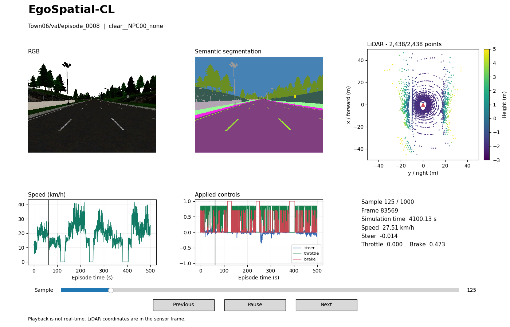

# EgoSpatial-CL Code

Code and documentation for reproducing and auditing:

**EgoSpatial-CL: A Spatially Controlled Multimodal Dataset for Continual Learning in Simulated Autonomous Navigation**

Dataset repository: https://huggingface.co/datasets/checo1092/egospatial-cl

## Scope

This repository contains the public release code needed to understand, regenerate, validate, and reuse the EgoSpatial-CL v1.0.0 dataset. It intentionally excludes generated dataset shards, experiment outputs, checkpoints, logs, local notes, and large third-party simulator assets.

## Layout

```text
dataset_generation/   Episode capture and schedule execution scripts.
configs/              Frozen v1.0.0 domain, spatial split, manifest, and executable schedule files.
validation/           Manifest, release, checksum, and shard-structure validation tools.
examples/             Dataset loading and visualization examples.
docker/               Container build helpers for CARLA 0.9.15 execution.
docs/                 Environment, generation protocol, and reproducibility notes.
```

## Dataset Summary

The frozen v1.0.0 dataset contains 7 towns, 7 compact domains, 10 spatial slots per town/domain pair, 490 episodes, and 490,000 synchronized samples. The train/validation/test split contains 392/49/49 episodes.

## Minimal Validation

```bash
python validation/validate_release.py \
  --manifest /path/to/benchmark_manifest.json \
  --shards-manifest /path/to/shards_manifest.csv

python validation/verify_checksums.py \
  --checksums /path/to/checksums.sha256 \
  --root /path/to/downloaded/release
```

## Loading Example

`examples/pytorch_dataset.py` provides a frame-level PyTorch `Dataset` for an
extracted EgoSpatial-CL copy. It reads the public `benchmark_manifest.json`,
filters by split, town, and domain, loads RGB, semantic-segmentation, and/or
LiDAR modalities, and returns control targets from `state.csv`.

Run a minimal loader smoke test with:

```bash
python examples/smoke_dataloader.py \
  --dataset-root /path/to/extracted/egospatial-cl \
  --manifest /path/to/benchmark_manifest.json \
  --split train \
  --frame-stride 100 \
  --batch-size 2
```

## Dataset Viewer

The Matplotlib viewer displays synchronized RGB, semantic segmentation, LiDAR,
and vehicle state from extracted Hugging Face episodes.



Example: `Town06/val/episode_0008`, frame `83569`.

In a Python 3.10+ desktop environment:

```bash
python -m pip install -r examples/requirements-viewer.txt

python examples/view_dataset.py \
  --dataset-root /path/to/extracted/egospatial-cl \
  --manifest /path/to/benchmark_manifest.json
```

See [visualization instructions](docs/visualization.md) for episode selection,
playback, PNG/GIF export, and an animated preview.

## Generation Schedule

Two schedule files are provided:

- `configs/egospatial_cl_v1_schedule.json`: episode-level release schedule aligned with the public manifest.
- `configs/egospatial_cl_v1_domain_schedule.json`: executable task schedule consumed by `dataset_generation/run_domain_schedule.py`.

Dry-run the executable schedule without starting CARLA:

```bash
python dataset_generation/run_domain_schedule.py \
  --schedule configs/egospatial_cl_v1_domain_schedule.json \
  --dataset-name egospatial_cl_v1 \
  --dry-run
```

## License

Code in this repository is released under the MIT License unless otherwise stated. Dataset files are released separately under CC BY 4.0. CARLA and other third-party software remain governed by their respective upstream licenses.

Dataset-derived images and animations in `docs/assets/` are licensed under CC BY 4.0. Source: [EgoSpatial-CL](https://huggingface.co/datasets/checo1092/egospatial-cl).
