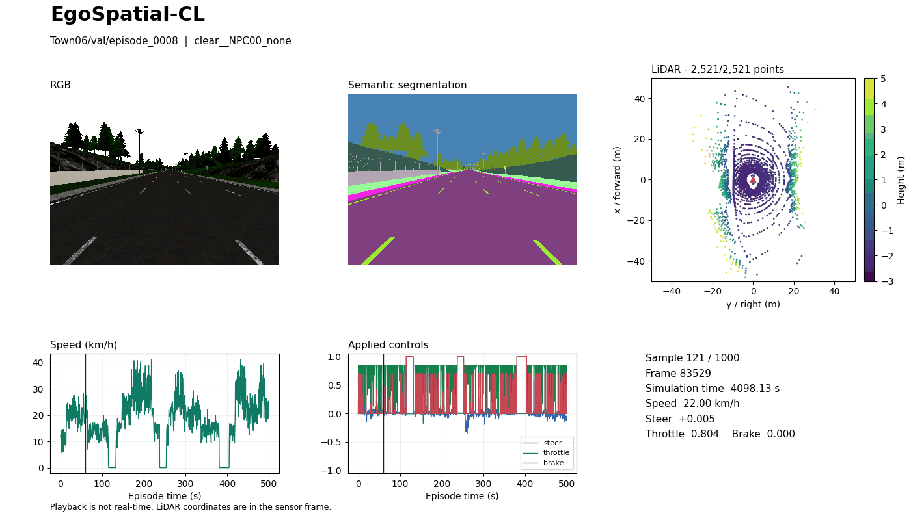

# Dataset Visualization

The local viewer displays synchronized RGB, color-encoded semantic segmentation,
LiDAR, and vehicle state from extracted Hugging Face release shards.
It uses a desktop Matplotlib window and Python 3.10+, NumPy, and Pillow.
CARLA, PyTorch, a GPU, and an internet connection are not required at runtime.

## Preview



Episode `Town06/val/episode_0008`, domain `clear__NPC00_none`; 24 saved samples,
indices 120-143 (zero-based). Playback is not real-time.
The animation is an exported panel; the desktop interface also includes playback
buttons and a sample slider.

These visualizations are derived from the
[EgoSpatial-CL dataset](https://huggingface.co/datasets/checo1092/egospatial-cl)
and are provided under CC BY 4.0. The
[export record](assets/viewer.gif.json) identifies the samples and rendering settings.

## Installation

From the code repository root, in a Python 3.10+ environment:

```bash
python -m pip install -r examples/requirements-viewer.txt
```

The dependency file records the versions used during validation.
Interactive mode also needs a graphical Matplotlib backend such as TkAgg
and a desktop display. PNG/GIF export works without a display.

## Input

Download the public `benchmark_manifest.json` and at least one shard, verify its
SHA256 checksum, and extract it using the release instructions. Pass the extraction
root containing this structure:

```text
<dataset-root>/
  Town06/
    val/
      episode_0008/
        images/
        labels/
        lidar/
        index.csv
        state.csv
        meta.json
```

The viewer does not download or extract archives. It discovers only locally
available episodes listed in the manifest. The unsharded generation layout
`<Town>/<episode>` is not supported.

## Local Interface

```bash
python examples/view_dataset.py \
  --dataset-root /path/to/extracted/egospatial-cl \
  --manifest /path/to/benchmark_manifest.json \
  --town Town06 \
  --split val \
  --episode Town06/val/episode_0008
```

The command opens one episode. Optional filters are `--town`, `--split`, and
`--domain-name`. Add `--list-episodes` to print locally available episode UIDs.
Without `--episode`, the first matching episode is selected.

The window provides previous/next sample buttons, play/pause, and a sample slider.
Left/right arrows also change samples; Space toggles playback. Close the window
to finish. Select LiDAR coloring with `--color height` (default) or
`--color intensity`. Set the initial sample with `--sample`.
The requested playback rate is approximate and also depends on rendering time.
All animated previews are labeled **Playback is not real-time.**

## Reading the Panels

- RGB and segmentation retain their original aspect ratio. Segmentation PNGs
  already contain the CARLA palette; they are not raw integer class masks.
- LiDAR is a bird's-eye projection in the sensor frame: x is forward/up on the
  plot and y is right. Axes span -50 to 50 meters. The origin marker denotes
  the sensor, not a fitted vehicle footprint.
- Height uses the fixed range -3 to 5 meters; intensity uses 0 to 1. Values
  outside the color range are clipped for coloring. The same Viridis scale is
  used in the interface and exports.
- By default, at most 20,000 points are drawn using deterministic subsampling.
  The panel reports displayed/total points. `--max-points` changes the display
  cap without modifying the stored cloud.
- Speed is derived as `3.6 * sqrt(vel_x^2 + vel_y^2 + vel_z^2)`, in km/h.
  Steer, throttle, and brake are recorded applied controls, not predictions.
- Simulation time comes from `sim_time`. Plot time is relative to the first
  saved sample; the vertical cursor marks the current sample.
- Images, LiDAR, and CSV state are joined by the simulator `frame` identifier.
  Missing/duplicate frame associations are errors. State CSV row order may differ
  from index order. A missing modality raises an error rather than substituting
  a different frame.

## Reproducible Exports

The CLI exports without opening a window:

```bash
python examples/view_dataset.py \
  --dataset-root /path/to/extracted/egospatial-cl \
  --manifest /path/to/benchmark_manifest.json \
  --episode Town06/val/episode_0008 \
  --sample 120 \
  --export outputs/preview.png

python examples/view_dataset.py \
  --dataset-root /path/to/extracted/egospatial-cl \
  --manifest /path/to/benchmark_manifest.json \
  --episode Town06/val/episode_0008 \
  --sample 120 \
  --count 24 \
  --stride 1 \
  --fps 6 \
  --export outputs/preview.gif
```

`--sample` is zero-based; the interface sample counter is one-based. GIFs
contain at most 120 frames and stop at the end of the episode without wrapping.
An existing export is not overwritten. Exports must be outside the extracted
dataset directory.

Each CLI export includes a companion `.png.json` or `.gif.json` file recording
the episode, domain, sample indices, simulator frame IDs/times, point cap,
color mode, and playback setting.

## Validation

Run the focused tests without opening a window:

```bash
python -B validation/test_view_dataset.py
```

For an interactive-backend error, run from a desktop terminal with a supported
Matplotlib GUI backend installed. For example, when Tk is installed:

```bash
MPLBACKEND=TkAgg python examples/view_dataset.py \
  --dataset-root /path/to/extracted/egospatial-cl \
  --manifest /path/to/benchmark_manifest.json \
  --episode Town06/val/episode_0008
```

For a headless session, use `--export` instead.

The output is a visualization of existing release data. It does not change
episodes, split assignments, manifests, or shard checksums.
